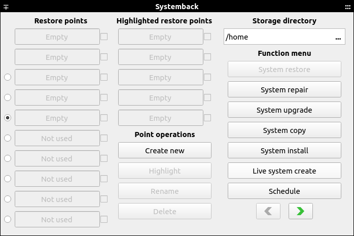
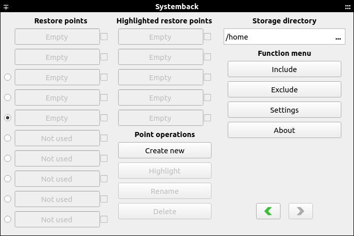

# Systemback

This is a fork of Systemback. The [original project](https://sourceforge.net/projects/systemback) is no longer maintained by the creator.

It's a simple system backup and restore application with extra features.

Systemback makes it easy to create backups of the system, configuration files, and user files. In case of problems you can easily restore the previous state of the system.

<p align="center">
  
  
  
</p>

## Donate

Systemback is free so you can use it without any limitations.

Keeping the project alive takes a lot of work and research. If you want to contribute, you can help with a small donation. Any amount will be very welcome. Your contribution will help keep the project running for a long time.

I hope this program will be very useful to you.

You can donate by clicking on [this link](https://www.paypal.com/donate/?hosted_button_id=NT6YZP9PV7SY6 "Click to Donate Here").

or

By scanning the QR Code below.


## Features

Systemback has several useful features, some of which are described below:

- System backup
- System copy
- System install
- System repair
- System restore
- System upgrade
- Live system create

## Requirements

Works as expected on:

- Linux Mint 19, 20 and 21

It's possible that it works on other equivalent distributions based on Ubuntu as well.

## Downloads

You can get the latest builds on the [release page](https://github.com/MaranBr/Systemback/releases).

## Installation

**Install Systemback**

Run the dpkg command to install the packages:

```
$ sudo dpkg -i *.deb
```

**Dependency Issues**

If there are dependency issues, install the missing dependencies with the following command:

```
$ sudo apt-get install -f
```

Then install the Systemback packages again.

## Wiki

If you need more info about the project, you can get more detailed information on the [wiki page](https://github.com/MaranBr/Systemback/wiki).
